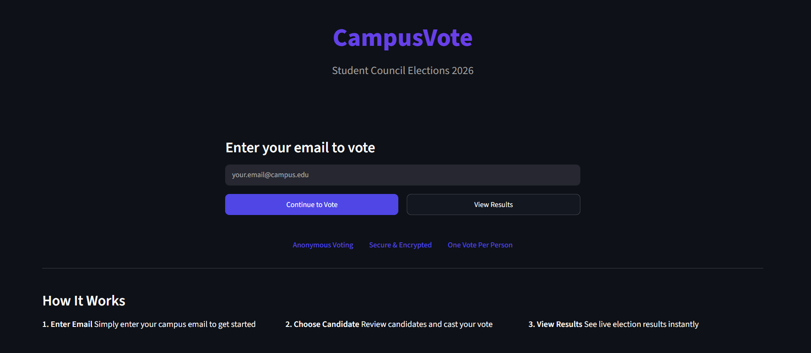
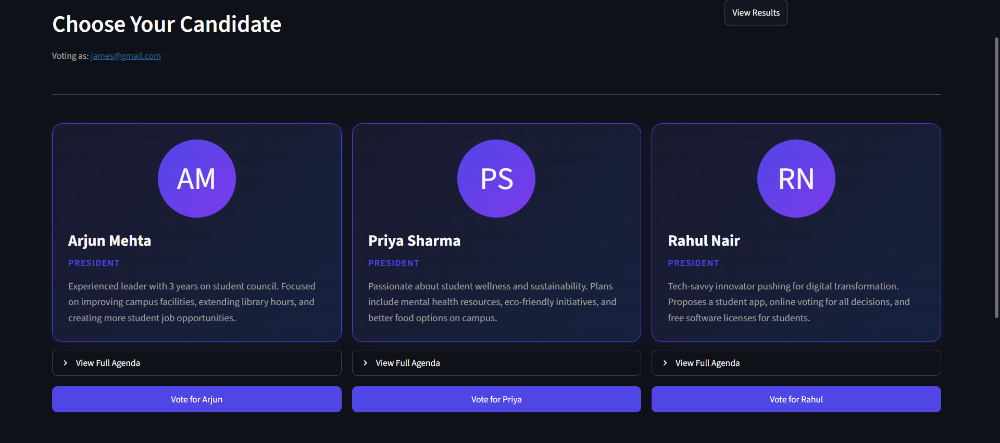
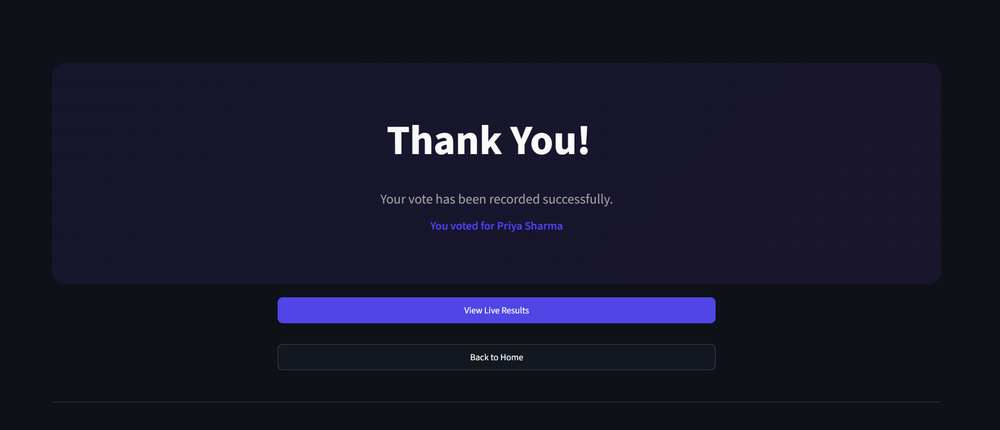
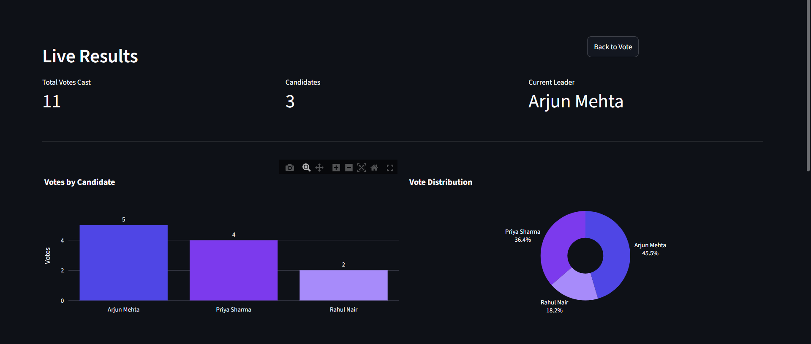

# CampusVote - Student Council Elections

A full-stack web-based voting platform for campus student council elections. Built as a single-page application with anonymous voting (SHA-256 hashed emails), real-time results, and a polished dark-themed UI.


## Screenshots

| Welcome Page | Voting Page |
|:---:|:---:|
|  |  |

| Thank You | Live Results |
|:---:|:---:|
|  |  |

## What Is CampusVote?

CampusVote is an end-to-end online voting system designed for college/university student council elections. It allows students to authenticate via email, cast a single vote for their preferred candidate, and view live election results through interactive charts -- all from a browser, no installation required.

The application handles the full election lifecycle:
1. **Voter Authentication** -- Students enter their campus email to verify eligibility
2. **Candidate Selection** -- Browse candidate profiles with their agendas and priorities
3. **Vote Casting** -- One-click voting with duplicate vote prevention
4. **Live Results** -- Real-time bar charts, pie charts, and detailed breakdowns

## Features

- **Anonymous Voting** -- Voter emails are SHA-256 hashed with a configurable salt before storage; raw emails never touch the database
- **One Vote Per Person** -- Three-layer duplicate prevention: application check, transactional re-check, and database UNIQUE constraint
- **Real-Time Results Dashboard** -- Interactive Plotly charts (bar + donut) update instantly after each vote
- **XSS-Safe Rendering** -- All user-supplied data is sanitized with `html.escape()` before HTML injection
- **Rate Limiting** -- Session-based cooldown prevents rapid-fire vote attempts
- **Input Validation** -- Anchored regex email validation with 100-character length cap
- **Dark Theme UI** -- Custom CSS with gradient cards, hover animations, and responsive layout
- **Pre-Seeded Demo Data** -- Ships with 3 candidates and 10 demo votes for immediate demonstration
- **Cloud-Ready** -- Configured for one-click deployment on Render with health checks

## Tech Stack

| Layer | Technology | Purpose |
|-------|-----------|---------|
| **Frontend** | Streamlit | UI framework with reactive widgets and session state |
| **Styling** | Custom CSS | Gradient cards, animations, dark theme, responsive layout |
| **Backend** | Python 3.9+ | Application logic, routing, input validation |
| **ORM** | SQLAlchemy 2.0 | Database abstraction, model definitions, session management |
| **Database** | SQLite | Lightweight relational storage, zero-config |
| **Visualization** | Plotly | Interactive bar charts and donut charts for results |
| **Security** | hashlib (SHA-256) | One-way email hashing for voter anonymity |
| **Deployment** | Render | Cloud hosting with auto-build and health checks |

## Architecture

```
┌─────────────────────────────────────────────────────────┐
│                      Browser (Client)                   │
└──────────────────────────┬──────────────────────────────┘
                           │ HTTP (WebSocket)
┌──────────────────────────▼──────────────────────────────┐
│                    Streamlit Server                      │
│  ┌───────────────────────────────────────────────────┐  │
│  │                   app.py                           │  │
│  │  ┌─────────┐ ┌─────────┐ ┌──────────┐ ┌───────┐  │  │
│  │  │ Welcome │ │  Vote   │ │ Thank You│ │Results│  │  │
│  │  │  View   │ │  View   │ │   View   │ │ View  │  │  │
│  │  └────┬────┘ └────┬────┘ └────┬─────┘ └───┬───┘  │  │
│  │       │           │           │            │      │  │
│  │       └───────────┴───────────┴────────────┘      │  │
│  │                       │                           │  │
│  │              Session State Router                 │  │
│  └───────────────────────┬───────────────────────────┘  │
│                          │                              │
│  ┌───────────────────────▼───────────────────────────┐  │
│  │              Business Logic Layer                 │  │
│  │  hash_email() │ validate_email() │ has_voted()    │  │
│  │  cast_vote()  │ seed_candidates()│ get_candidates()│ │
│  └───────────────────────┬───────────────────────────┘  │
│                          │                              │
│  ┌───────────────────────▼───────────────────────────┐  │
│  │           database.py + models.py                 │  │
│  │  SQLAlchemy Engine → SessionLocal → ORM Models    │  │
│  │  ┌────────────────┐  ┌─────────────────────────┐  │  │
│  │  │   Candidate    │  │         Vote            │  │  │
│  │  │ - id (PK)      │  │ - id (PK)              │  │  │
│  │  │ - name         │  │ - voter_hash (UNIQUE)   │  │  │
│  │  │ - position     │  │ - candidate_id (FK)     │  │  │
│  │  │ - description  │  │ - voted_at              │  │  │
│  │  │ - photo        │  │                         │  │  │
│  │  │ - vote_count   │  │                         │  │  │
│  │  └────────────────┘  └─────────────────────────┘  │  │
│  └───────────────────────┬───────────────────────────┘  │
│                          │                              │
│  ┌───────────────────────▼───────────────────────────┐  │
│  │                SQLite Database                    │  │
│  │     Local: ./evoting.db │ Cloud: /tmp/evoting.db  │  │
│  └───────────────────────────────────────────────────┘  │
└─────────────────────────────────────────────────────────┘
```

**Data Flow:**
1. User enters email on Welcome screen
2. Email is validated (anchored regex + length check) and normalized (lowercase + trim)
3. Email is SHA-256 hashed with an application salt -- raw email stays in memory only
4. System checks `votes` table for existing hash match
5. If eligible, user selects a candidate and `cast_vote()` runs inside a single transaction:
   - Hashes email and re-checks for duplicate (race condition guard)
   - Inserts hash into `votes` table
   - Increments `vote_count` on `candidates` table
   - Commits or rolls back atomically
   - `IntegrityError` on the UNIQUE constraint is caught as a final safety net
6. Results page queries candidates sorted by `vote_count` and renders Plotly charts

## Security & Privacy

### Threat Model

| Threat | Mitigation | Layer |
|--------|-----------|-------|
| **Voter de-anonymization** (DB leak reveals who voted for whom) | Emails are SHA-256 hashed with a configurable salt (`EMAIL_SALT` env var) before storage. Raw emails never reach the database. | Application |
| **Duplicate voting** (same person votes twice) | Three-layer defense: `has_voted()` pre-check, `cast_vote()` re-check within the same transaction, and `UNIQUE` constraint on `voter_hash` column | Application + Database |
| **Race condition** (concurrent requests bypass duplicate check) | `IntegrityError` from the UNIQUE constraint is caught specifically and returns the correct "already voted" message instead of a generic error | Database |
| **XSS** (malicious script in candidate data) | All dynamic data is sanitized via `html.escape()` before injection into `unsafe_allow_html=True` blocks | Application |
| **SQL Injection** | SQLAlchemy ORM with parameterized queries throughout -- zero raw SQL | ORM |
| **Vote spamming** (rapid-fire requests) | Session-based 2-second cooldown between vote attempts | Application |
| **Input abuse** (oversized or malformed emails) | Anchored regex (`^...$`), 100-character length cap, normalization (lowercase + trim) | Application |
| **CSRF** | Mitigated by Streamlit's WebSocket architecture -- no traditional form submissions | Framework |
| **Session hijacking** | Session state is server-side only, managed by Streamlit's internal session management | Framework |
| **Information disclosure** | Error messages are generic -- no stack traces, SQL statements, or internal paths leaked to users | Application |

### Security Configuration

Set the `EMAIL_SALT` environment variable in production to a unique, secret value:

```bash
# Render / production
EMAIL_SALT="your-unique-random-secret-here"

# The default salt is only suitable for development/demo
```

## Technical Challenges Solved

### 1. Voter Anonymity with Duplicate Prevention
Achieving both anonymity and one-vote-per-person is a fundamental tension: you need to remember who voted (to block duplicates) without knowing who voted (for privacy). CampusVote solves this by storing a SHA-256 hash of the email with a server-side salt. The hash is deterministic (same email always produces the same hash for duplicate detection) but irreversible (the database never contains the raw email). Even if the database is leaked, an attacker cannot determine which email maps to which vote without brute-forcing against the salt.

### 2. Three-Layer Duplicate Vote Prevention
A single check isn't enough in a concurrent web app. Two requests arriving simultaneously could both pass the check before either commits. CampusVote uses three layers:
- **Layer 1 -- UI gate:** `has_voted()` checks the hash before showing the vote form
- **Layer 2 -- Transaction guard:** `cast_vote()` re-checks inside the same DB transaction before inserting
- **Layer 3 -- DB constraint:** `UNIQUE` on `voter_hash` catches any race condition that slips through, with a specific `IntegrityError` handler returning the correct user-facing message

### 3. XSS Prevention in Dynamic HTML
Streamlit's `unsafe_allow_html=True` is required for custom-styled candidate cards, but it opens the door to XSS if candidate data is rendered directly. All dynamic data (names, descriptions, initials) passes through Python's `html.escape()` before HTML template injection, preventing script execution even if candidate data is compromised at the database level.

### 4. SPA-Like Routing in Streamlit
Streamlit re-runs the entire script on every interaction, making traditional routing impossible. CampusVote implements a state-machine router using `st.session_state.view` to track the current screen (welcome, vote, thank_you, results). Each `st.rerun()` call triggers a fresh execution that reads the current state and renders the correct view, simulating single-page app navigation.

### 5. Ephemeral Filesystem on Cloud (Render Deployment)
Render's free tier uses an ephemeral filesystem -- the app directory is read-only, and data written to it is lost on redeploy. CampusVote handles this by:
- Detecting the `RENDER` environment variable and switching the SQLite path to `/tmp/evoting.db`
- Using `@st.cache_resource` to initialize the database only once per server process, avoiding re-seeding on every Streamlit rerun
- Pre-seeding demo data on first boot so the app is immediately demonstrable

### 6. Atomic Vote Count Maintenance
Instead of computing vote counts from the `votes` table on every request (expensive `COUNT + GROUP BY`), CampusVote maintains a denormalized `vote_count` column on the `candidates` table. This count is updated atomically within the same database transaction as the vote insert, ensuring consistency without expensive aggregation queries on the results page.

### 7. Session Isolation
Each browser tab gets its own Streamlit session with independent state. The app carefully separates session state (which view, cooldown timers) from database state (votes, candidates), ensuring one user's actions don't corrupt another's UI state.

## Project Structure

```
E-voting/
├── app.py              # Main application (views, routing, security, business logic)
├── database.py         # SQLAlchemy engine, session factory, init_db()
├── models.py           # ORM models (Candidate, Vote with hashed email)
├── requirements.txt    # Python dependencies
├── render.yaml         # Render cloud deployment config
├── .streamlit/
│   └── config.toml     # Streamlit theme (dark mode, indigo accent)
└── .gitignore
```

## Quick Start

```bash
# Clone the repo
git clone https://github.com/pavandeshpande12/campusvote.git
cd campusvote

# Create virtual environment
python -m venv venv
source venv/bin/activate   # Linux/Mac
venv\Scripts\activate      # Windows

# Install dependencies
pip install -r requirements.txt

# Run the app
streamlit run app.py
```

The app opens at `http://localhost:8501`. The database is created automatically on first run with 3 pre-seeded candidates and 10 demo votes.

### Environment Variables

| Variable | Required | Default | Purpose |
|----------|----------|---------|---------|
| `EMAIL_SALT` | No (but recommended in production) | Dev default in source | Salt for SHA-256 email hashing |
| `DATABASE_URL` | No | `sqlite:///evoting.db` | Database connection string |
| `RENDER` | No | Not set | Auto-set by Render; switches DB path to `/tmp/` |

## Live Demo

[View Live App on Render](https://campusvote-nsnq.onrender.com)

> Note: The free Render instance spins down after inactivity. First load may take 30-60 seconds.

## Database Schema

```sql
candidates
├── id          INTEGER PRIMARY KEY
├── name        VARCHAR(100) NOT NULL
├── position    VARCHAR(100) NOT NULL DEFAULT 'President'
├── description TEXT
├── photo       VARCHAR(255)
└── vote_count  INTEGER DEFAULT 0

votes
├── id            INTEGER PRIMARY KEY
├── voter_hash    VARCHAR(64) NOT NULL UNIQUE   -- SHA-256 hash, not raw email
├── candidate_id  INTEGER NOT NULL              -- FK -> candidates.id
└── voted_at      DATETIME                      -- UTC timestamp
```

## Author

**Pavan Deshpande**

---

Built with Streamlit
